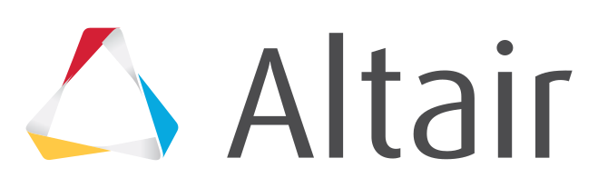
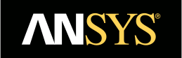
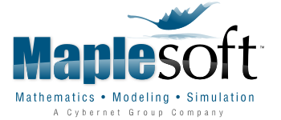
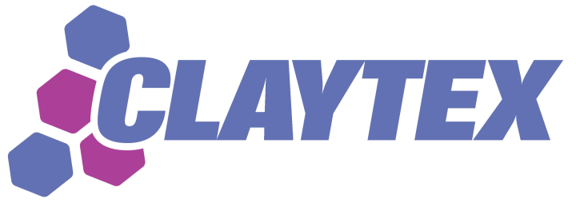
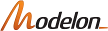
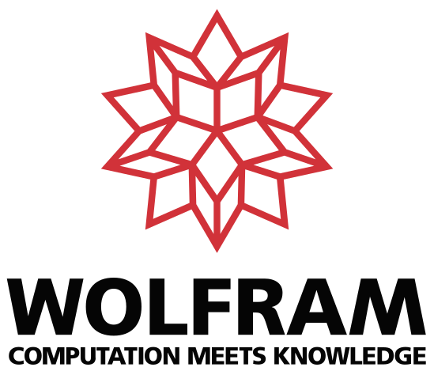

# Gold Sponsors

Altair focuses on the development and application of simulation technology to synthesize and optimize designs, processes and decisions for improved business performance. Privately held, Altair is headquartered in Troy, MI, USA, has more than 2,600 employees in over 45 offices throughout 20 countries, and serves more than 5,000 corporate clients.

ANSYS is the global leader in engineering simulation. We bring clarity and insight to our customer's most complex design challenges through the broadest portfolio of fast, accurate and reliable simulation tools. Our technology enables organizations in all industries to imagine high-quality, innovative product designs that are sustainable and have an accelerated time to market. Founded in 1970, ANSYS employs almost 3000 professionals, more than 700 of them with PhDs in engineering fields such as finite element analysis, computational fluid dynamics, electronics and electromagnetics, embedded software, system simulation and design optimization. Headquartered south of Pittsburgh, U.S.A., ANSYS has more than 75 strategic sales and development locations throughout the world with a network of channel partners in 40+ countries.

Dassault Systèmes, the 3DEXPERIENCE Company, provides business and people with virtual universes to imagine sustainable innovations. Its world-leading solutions transform the way products are designed, produced, and supported. Dassault Systèmes delivers roles and applications, Dymola and CATIA Dymola Behavior Modeling, for System Modeling and Simulation, using the open Modelica language.

MapleSim is a Modelica-based system-level modeling and simulation tool that applies modern techniques to dramatically reduce model development time, provide greater insight into system behavior, and produce fast, high-fidelity simulations. The combination of Modelica with the symbolic computation power of MapleSim enables a level of understanding, power, and extensibility not possible with “black-box” tools.

# Silver sponsors

Claytex is an engineering consultancy specialised in systems engineering. Our core competency is in the modelling, simulation and analysis of complex multi-domain systems such as cars & aircraft, using Dymola & Modelica. Since 1999, we've been working with some of the world's most respected Automotive, Motorsport/F1, Aerospace & Energy companies.

Modelon is a global expert in solutions for model-based systems and a leader in developing and supporting the Modelica and FMI open standards. Our open and flexible tools and model libraries for simulation and optimization accelerate virtual product creation and allow our customers to focus on their core business objectives.

Wolfram is the company where computation meets knowledge. For three decades, Wolfram has been a leader in knowledge-based programming, creating innovative technologies like Mathematica and the Wolfram Language. Wolfram SystemModeler brings this tradition of innovation to modeling and simulation.

# Exhibitors

* Altair Engineering
* ANSYS
* CENIT AG
* Claytex Services
* Concurrent Computer
* Dassault Systèmes
* ESI ITI GmbH
* FAB Bertelmann Technologie
* FEV SA
* LTX Simulation GmbH
* Maplesoft
* Modelon
* National Instruments
* Open Source Modelica Consortium
* Ricardo Software
* Schlegel Simulation GmbH
* Wolfram
